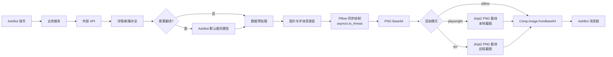
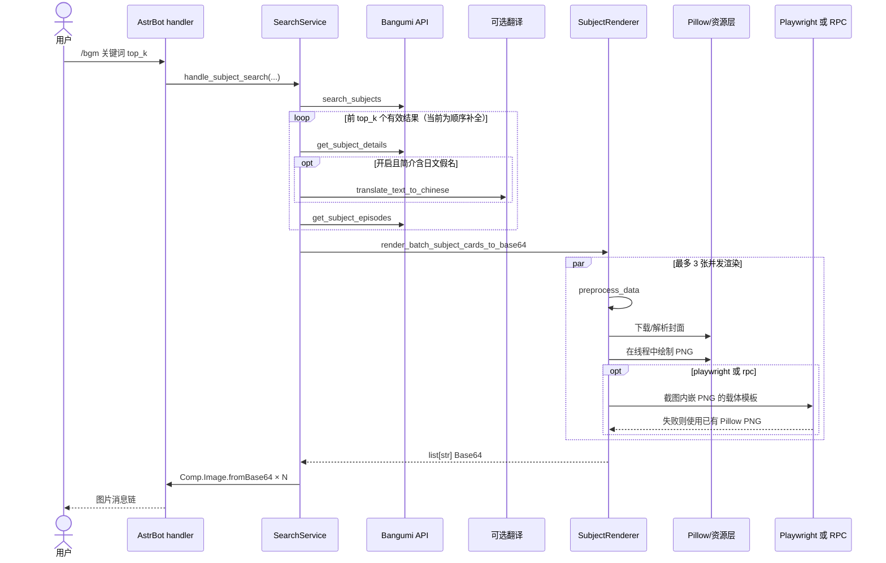
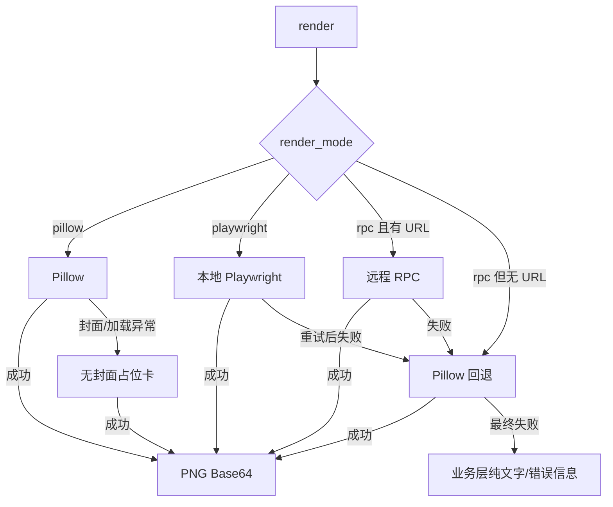

# 图文卡片技术方案与 AstrBot 迁移指南

本文面向使用 Python 编写的 AstrBot 插件，说明本仓库如何把 API 数据转换成 PNG/Base64 图文消息，并给出一套可迁移到其他业务的实现边界。重点是 `/bgm` 搜索条目卡；单集卡、放送日历和长文本卡只介绍共用机制与关键差异。

> 本文依据仓库 `v1.5.6` 的实现编写。当前插件要求 AstrBot `>=4.26.2,<5`，README 标注 Python `3.12+`。下文的“当前实现”用于理解本仓库，“推荐设计”用于新插件；推荐接口不是本仓库的公共 API。

## 1. 先给结论

当前图文链路可以概括为：

- 业务层使用异步 Python 获取和补全数据，网络连接由共享 `aiohttp.ClientSession` 复用。
- Pillow 是搜索条目卡、单集卡、放送日历和长文本卡的主渲染器，绘制结果统一为 PNG Base64。
- 搜索条目卡、单集卡和长文本卡在 `playwright`/`rpc` 模式下通常先生成同一张 Pillow PNG，再让 Jinja2 模板用 `` 承载并截图，以保持模式间的像素一致。
- 日历的非 Pillow 模式仍使用独立的 HTML/CSS 模板；浏览器或 RPC 失败后才回退 Pillow。因此不能笼统认为所有 HTML 模式都只是在截取 Pillow 图片。
- Pillow 的同步绘制通过 `asyncio.to_thread()` 离开事件循环；封面下载仍是异步 I/O。
- 最终由 AstrBot 的 `Comp.Image.fromBase64(...)` 包装图片。长文本渲染失败时明确回退纯文字；搜索和日历失败时也会返回文字错误信息。

主要源码入口如下：

| 职责 | 当前实现 |
| --- | --- |
| 插件初始化、共享 Session、文字兜底 | [`main.py`](../main.py) |
| 搜索、详情补全、简介翻译、消息组装 | [`src/app/search_service.py`](../src/app/search_service.py) |
| 渲染模式选择与 RPC/Playwright 回退 | [`src/render/base_renderer.py`](../src/render/base_renderer.py) |
| 搜索条目卡 | [`src/render/subject_renderer.py`](../src/render/subject_renderer.py) |
| 单集卡 | [`src/render/episode_renderer.py`](../src/render/episode_renderer.py) |
| 放送日历 | [`src/render/calendar_renderer.py`](../src/render/calendar_renderer.py) |
| 长文本卡 | [`src/render/response_renderer.py`](../src/render/response_renderer.py) |
| 图片、字体、排版和 Pillow 工具 | [`src/render/pillow_utils.py`](../src/render/pillow_utils.py) |
| Jinja2 载体模板 | [`src/templates/`](../src/templates) |

## 2. 整体架构



这张图描述条目卡、单集卡和长文本卡的常规路径。日历在 `playwright`/`rpc` 模式下由 Jinja2 模板直接排版 API 数据和远程封面，只有回退时才进入 Pillow。

以搜索条目为例，实际调用顺序如下：



当前搜索补全有一个值得留意的性能特征：详情、翻译和剧集请求按候选逐项执行，等数据全部准备好之后，图片渲染才以 `Semaphore(3)` 并发。迁移时可以在 API 限流允许的前提下并发补全，但应单独设置网络并发上限，不能直接无限 `gather()`。

## 3. 三种渲染模式与回退

`render_mode` 默认值为 `pillow`，旧值 `html` 会归一化为 `playwright`。

| 模式 | 当前行为 | 失败路径 | 适用场景 |
| --- | --- | --- | --- |
| `pillow` | 直接绘制 PNG 并编码 Base64 | 封面失败使用占位；条目卡和单集卡绘制异常会再尝试无封面纯 PIL 卡片 | 默认选择，部署最简单、结果稳定 |
| `playwright` | 本地 Chromium 渲染 Jinja2 HTML 并截图 | 本地截图按 `max_retries` 重试，最终回退 Pillow | 必须兼容已有 HTML/CSS 或需要浏览器能力 |
| `rpc` | 把 HTML、选择器和截图参数提交给 JSON-RPC 服务 | RPC 失败或 URL 缺失后直接回退 Pillow | 渲染必须跨进程/跨主机隔离 |



这里有两个容易误解的点：

1. `rpc` 失败不会继续尝试本地 Playwright，而是直接调用 Pillow 回退。
2. `max_retries=3` 作用于本地 Playwright 的截图重试；当前 RPC 请求本身没有套用这组重试。

当前默认 RPC 地址为 `https://api.unitedpooh.top/rpc`，截图请求的总超时通常为 30 秒；日历截图前还会等待 2 秒以加载远程资源。新插件不应无条件依赖公共 RPC，建议把端点、鉴权、超时和数据合规策略全部配置化。

## 4. 搜索条目卡详解

### 4.1 从 API 字典到稳定数据契约

当前业务层先搜索候选，再逐个请求详情；剧集接口成功时把 `data` 挂到详情的 `episodes` 字段。可选的简介翻译也发生在渲染前：纯中文简介跳过，含日文假名的日文或中日混合简介才调用 AstrBot 默认聊天模型，失败则保留原文。

`preprocess_data()` 随后复制输入字典并规范化以下字段：

| 视觉字段 | 接受的来源 | 当前规范化/缺省策略 |
| --- | --- | --- |
| 主标题 | `name_cn`，否则 `name` | 都为空时显示“未知条目”；原名与主标题相同则不重复显示 |
| 封面 | `image_url` 或 `images` | `images` 优先级为 `large → common → medium`；无有效图片时使用纯色占位 |
| 日期 | `date` 或 `air_date` | `date` 缺失时复制 `air_date`；两者都没有则页脚不显示日期 |
| 平台 | `platform` 或 `type` | 数字/数字字符串通过 `SubjectType` 转显示名；未知值显示“未知” |
| 总话数 | `total_episodes`、`eps` 或 infobox“话数” | 提取第一个正整数；缺失时进度可退回有效剧集数 |
| 标签 | `tags[].name` | 取前 8 个，最多绘制两行；过宽标签省略，超出两行的标签停止绘制 |
| 简介 | `summary` | 把连续空白压成单个空格；缺失时显示“暂无简介” |
| 评分 | `rating.score/rank/total/count` | 分数固定一位小数；缺项显示 `--`；`count` 用于 1–10 分分布图 |
| 收藏状态 | `collection.doing` | 正数显示“n 人在看”，缺失或 0 不显示 |
| 剧集进度 | `episodes[]` | 仅保留正篇 `type=0` 且 `ep!=0`；有效播出日期不晚于今天视为已播，缺少/无效日期时评论数大于 0 也视为已播 |

从迁移角度看，最重要的规则是：不要让外部 API 的原始字典直接进入绘制函数。当前仓库在逐步用 `TypedDict`、Pydantic 和预处理函数约束数据；新插件更适合在边界处一次性转换成自己的 `CardRenderData`，从此不再认识 Bangumi 的字段名。

### 4.2 2400 px 基准画布与动态高度

条目卡固定宽度为 2400 px，基础高度为 1638 px，采用左侧封面/进度/评分、右侧标题/标签/简介的双栏布局。

- 左栏宽约 780 px。封面框坐标为 `(75, 78, 705, 969)`，即 630×891 px。
- 右栏从 `x=840` 开始，标题区、评分区、标签区、简介区和页脚按固定节奏排列。
- 标签默认从 `y=494` 开始；一行放不下时换到第二行，并把简介起点从 `y=628` 下移到 `y=704`。
- 简介不限制行数。渲染器先用与实际相同的字体、宽度和行距测量完整文本，再令页脚位于简介末尾之后，因此长简介会增加卡片高度而不是静默截断。
- 高度还会随剧集网格行数增加。测试夹具的短简介、单行剧集网格输出是 2400×1638；不能把 1638 当成所有条目的固定高度。

左栏剧集网格为 7 列、最多 4 行，每格 72 px、间距 10 px，因此最多可见 28 集。网格行数从 1 增加到 4 时，评分分布和基础高度每增加一行下移 82 px。进度标题统计全部有效正篇剧集，而网格只展示前 28 个；迁移到长篇内容时，最好另外显示“还有 n 集”或改用进度条，避免用户误以为数据被截断。

评分分布卡读取 1–10 分计数，以最高计数归一化柱高；8–10 分使用强调色。页脚展示日期、平台和条目 ID。上述区域都先计算坐标，再由一个同步绘制函数完成，布局逻辑没有散落到 AstrBot handler 中。

### 4.3 三种风格共享布局

三种搜索卡风格是：

- `pastel_lightbox`：暖白底、粉彩强调、薄荷侧栏。
- `editorial_digest`：低饱和纸张色、灰绿色强调，接近编辑部摘要。
- `cinematic_poster`：暖色海报装饰和斜向构图元素。

它们共享字段提取、文本测量、坐标、网格和评分分布逻辑，只通过冻结的 `SubjectCardStyle` 调色板提供 `surface`、`card`、`accent`、`title`、`muted`、`panel` 等颜色，并在少数位置增加风格专属装饰。这样新增配色不会复制一整套业务逻辑，也不会造成三套模板对缺字段的处理不一致。

仓库中的实际预览图可直接对照：

| Pastel Lightbox | Editorial Digest | Cinematic Poster |
| :---: | :---: | :---: |
|  |  |  |

### 4.4 封面、圆角、阴影与透明通道

封面使用 `ImageOps.fit()` 等比缩放并居中裁剪到目标框，再用灰度圆角蒙版写入 alpha 通道。阴影在独立透明图层上绘制圆角矩形、做高斯模糊，最后 `alpha_composite()` 到主画布，因此不会污染封面本身。

图片源支持 Base64 data URI 和 HTTP/HTTPS URL。HTTP 图片限制如下：

- 只接受 `http`、`https`，拒绝本地文件路径和其他协议。
- 总超时 10 秒。
- 最大 8 MiB：同时检查 `Content-Length` 和分块读取后的累计大小。
- 代理参数会透传到 `aiohttp` 请求。
- 状态码异常、超时、网络错误、无法识别图片或过大时返回 `None`，绘制层继续生成占位卡。

条目卡的占位封面使用当前风格的柔和强调色。日历和部分单集布局会使用带标题首字或渐变的占位图。卡片使用 RGBA 画布；条目卡边缘还保留极轻微的 alpha 抗锯齿，以贴近浏览器定位截图的边缘表现。

## 5. 其他三类卡片

### 5.1 单集更新卡

单集卡固定为 2304×3072 px（3:4），同样提供三种风格，但这里每种风格有独立的视觉布局函数：

- `cinematic_poster`：全幅封面、底部渐变、醒目的集数和标题。
- `editorial_digest`：纸张式留白、独立封面框和编辑摘要信息层级。
- `pastel_lightbox`：粉彩背景、灯箱式封面与浮层信息面板。

三者仍共享标题、日期、时长、评论数等字段格式化函数。非 Pillow 模式优先把 Pillow 结果嵌入 `update/episode.html`；只有预渲染本身抛出异常时，模板才会使用其完整 HTML/CSS 布局。

### 5.2 放送日历

Pillow 日历固定宽度 2892 px，最多绘制七列，并把“今天”旋转到第一列且加重描边。高度公式为 `max(2124, 426 + 单日最大条目数 × 740)`，所以同一天有更多条目时画布向下增长。每个条目包含裁剪封面、最多两行标题、评分和排名。

日历封面使用 `Semaphore(6)` 并发下载，再统一在线程中绘制。`playwright`/`rpc` 模式使用 `calendar/calendar.html` 的七列 CSS Grid 直接加载远程图片；失败后才执行上述 Pillow 链路。

### 5.3 长文本响应卡

普通响应满足以下任一条件时自动图片化：

- 文本长度大于 30 个 Python 字符；
- 文本包含换行。

恰好 30 字且无换行仍发送纯文字。卡片宽 1600 px，高度随正文增长，最低 760 px；保留显式换行并最多显示 30 行。为降低字体缺字风险，常见状态 emoji 会先替换为“注意:”“错误:”“完成:”等文字。渲染器异常或返回空值时，`main.py` 会发送原始纯文字。

## 6. 推荐的新插件模块边界

第一版建议只实现 Pillow 主链路和纯文字兜底。下面的边界比复制本仓库文件更容易测试，也更适合非 Bangumi 业务。

```text
your_plugin/
├── main.py                     # AstrBot 指令与消息适配
├── models/
│   └── cards.py                # 经校验的 CardRenderData
├── services/
│   └── item_service.py         # API 查询、补全和领域转换
└── rendering/
    ├── renderer.py             # 模式、并发、超时、回退编排
    ├── image_loader.py         # 异步图片获取与安全限制
    ├── fonts.py                # 字体发现、缓存和预热
    ├── layout.py               # 纯布局计算
    ├── subject_card.py         # 同步 Pillow 绘制
    └── styles.py               # 类型化调色板
```

职责应稳定在以下边界：

| 层 | 输入 | 输出 | 不应负责 |
| --- | --- | --- | --- |
| 业务/输入层 | 外部 API 响应 | `CardRenderData` | 坐标、字体、Base64 消息 |
| 资源层 | 已校验 URL | `PIL.Image.Image | None` | 业务字段解释、卡片布局 |
| 布局层 | 数据、字体测量结果、画布约束 | 坐标/尺寸值对象 | 网络、AstrBot 消息 |
| 绘制层 | 数据、已加载资源、风格、布局 | PNG Base64 | `await`、重试、消息发送 |
| 编排层 | 卡片模型、模式 | `str | None` | API 原始字典、AstrBot event |
| AstrBot 适配层 | Base64 或 `None` | `Comp.Image` 或纯文字 | Pillow 细节、资源下载 |

### 6.1 数据模型

下面是与具体 API 解耦的最小模型。业务层负责把自己的 `cover_url`、评分和进度填进来；缺字段是正常状态，不应靠 `KeyError` 驱动流程。

```python
from typing import Literal

from pydantic import BaseModel, Field

CardStyle = Literal[
    "pastel_lightbox",
    "editorial_digest",
    "cinematic_poster",
]


class RatingData(BaseModel):
    score: float | None = None
    rank: int | None = None
    total: int | None = None
    distribution: dict[int, int] = Field(default_factory=dict)


class EpisodeProgress(BaseModel):
    number: int
    aired: bool = False


class CardRenderData(BaseModel):
    id: str
    title: str
    original_title: str = ""
    cover_url: str | None = None
    date: str = ""
    platform: str = ""
    summary: str = "暂无简介"
    tags: list[str] = Field(default_factory=list)
    rating: RatingData | None = None
    episodes: list[EpisodeProgress] = Field(default_factory=list)
```

更复杂的插件可以从 `CardRenderData` 派生 `SubjectCardData`、`EpisodeCardData`、`CalendarCardData`，但不要为了“统一”而把几十个互不相关的可空字段塞进同一个模型。

### 6.2 资源加载器

资源层应复用插件级 Session、限制协议/超时/大小，并把“图片不可用”表示为 `None`。以下是精简骨架：

```python
import asyncio
import io
from urllib.parse import urlparse

import aiohttp
from PIL import Image, UnidentifiedImageError

MAX_IMAGE_BYTES = 8 * 1024 * 1024


def decode_image(payload: bytes) -> Image.Image:
    with Image.open(io.BytesIO(payload)) as image:
        return image.convert("RGBA")


class ImageLoader:
    def __init__(
        self,
        session: aiohttp.ClientSession,
        *,
        proxy_url: str | None = None,
        max_concurrency: int = 6,
    ) -> None:
        self.session = session
        self.proxy_url = proxy_url
        self.semaphore = asyncio.Semaphore(max_concurrency)

    async def load(self, url: str | None) -> Image.Image | None:
        if not url or urlparse(url).scheme not in {"http", "https"}:
            return None

        timeout = aiohttp.ClientTimeout(total=10)
        try:
            async with self.semaphore:
                async with self.session.get(
                    url, timeout=timeout, proxy=self.proxy_url
                ) as response:
                    if response.status != 200:
                        return None
                    length = response.headers.get("Content-Length", "")
                    if length.isdigit() and int(length) > MAX_IMAGE_BYTES:
                        return None

                    payload = bytearray()
                    async for chunk in response.content.iter_chunked(64 * 1024):
                        payload.extend(chunk)
                        if len(payload) > MAX_IMAGE_BYTES:
                            return None
            return await asyncio.to_thread(decode_image, bytes(payload))
        except (
            aiohttp.ClientError,
            TimeoutError,
            OSError,
            ValueError,
            UnidentifiedImageError,
        ):
            return None
```

如果业务确实需要 data URI，应单独实现严格的 MIME、Base64 和大小校验；不要顺手开放 `file://`。生产环境还可以校验最终解析 IP，防止 URL 重定向或 DNS 解析绕过内网访问限制。

### 6.3 同步绘制与异步编排

绘制函数保持同步纯函数：创建 RGBA 画布、计算布局、裁剪封面、绘制文字，最后写入内存 PNG。它不访问网络，也不认识 AstrBot。

```python
import base64
import io
from PIL import Image


def draw_subject_png_base64(
    data: CardRenderData,
    cover: Image.Image | None,
    style: CardStyle,
) -> str:
    canvas = draw_subject_canvas(data, cover, style)  # 你的纯 Pillow 实现
    output = io.BytesIO()
    canvas.save(output, format="PNG")
    return base64.b64encode(output.getvalue()).decode("ascii")
```

编排层负责把 I/O 和 CPU 工作组合起来，并定义统一的失败语义：

```python
import asyncio


class CardRenderer:
    def __init__(
        self,
        image_loader: ImageLoader,
        *,
        max_concurrency: int = 3,
    ) -> None:
        self.image_loader = image_loader
        self.render_slots = asyncio.Semaphore(max_concurrency)

    async def render(
        self,
        data: CardRenderData,
        style: CardStyle = "pastel_lightbox",
    ) -> str | None:
        async with self.render_slots:
            cover = await self.image_loader.load(data.cover_url)
            try:
                return await asyncio.to_thread(
                    draw_subject_png_base64, data, cover, style
                )
            except (OSError, ValueError, RuntimeError):
                # 有封面时再试一次无封面卡；仍失败则交给上层发纯文字。
                if cover is not None:
                    try:
                        return await asyncio.to_thread(
                            draw_subject_png_base64, data, None, style
                        )
                    except (OSError, ValueError, RuntimeError):
                        pass
                return None

    async def render_many(
        self,
        cards: list[CardRenderData],
        style: CardStyle,
    ) -> list[str]:
        results = await asyncio.gather(
            *(self.render(card, style) for card in cards),
            return_exceptions=True,
        )
        return [item for item in results if isinstance(item, str) and item]
```

异常范围要根据自己的 Pillow、字体和布局实现调整。不要用无限重试掩盖确定性的排版异常；下载重试也只应覆盖幂等、短暂的网络故障，并配合退避与总时限。

### 6.4 AstrBot 初始化与指令接入

插件级创建一个 Session，所有 API 客户端和图片加载器共享它，并在 `terminate()` 中关闭。AstrBot 适配层只负责包装 Base64：

```python
from collections.abc import AsyncGenerator

import aiohttp
import astrbot.api.message_components as Comp
from astrbot.api.event import AstrMessageEvent, filter
from astrbot.api.star import Context, Star


class ExampleCardPlugin(Star):
    def __init__(self, context: Context) -> None:
        super().__init__(context)
        self.session: aiohttp.ClientSession | None = None
        self.renderer: CardRenderer | None = None

    async def initialize(self) -> None:
        self.session = aiohttp.ClientSession()
        loader = ImageLoader(self.session, max_concurrency=6)
        self.renderer = CardRenderer(loader, max_concurrency=3)
        # 可在后台线程预热字体缓存，但不要阻塞插件初始化。

    @filter.command("card")
    async def card(
        self, event: AstrMessageEvent, query: str
    ) -> AsyncGenerator[object, None]:
        if self.renderer is None:
            yield event.plain_result("图片服务尚未就绪")
            return

        raw_item = await fetch_item(query)       # 业务 API
        card_data = to_card_render_data(raw_item)  # 边界校验/规范化
        payload = await self.renderer.render(card_data)
        if payload:
            yield event.chain_result([Comp.Image.fromBase64(payload)])
        else:
            yield event.plain_result(format_item_as_text(card_data))

    async def terminate(self) -> None:
        if self.session and not self.session.closed:
            await self.session.close()
        await super().terminate()
```

多结果搜索时，把多个 `Comp.Image.fromBase64(payload)` 放进同一个 `chain_result` 即可。需要控制消息体积或平台风控时，也可以逐张发送或限制 `top_k`，但这属于 AstrBot 适配策略，不应侵入绘制函数。

## 7. 字体与中文/日文排版

中文和日文混排的主要风险不是“字体文件不存在”，而是当前字体存在却缺少某些字形。本仓库的处理包含四层：

1. 启动时在后台线程预热字体，不阻塞插件主流程。
2. 优先寻找下载缓存中的 Resource Han Rounded CN、Noto Sans CJK SC、Zen Maru Gothic，再检查 macOS、Linux、Windows 常见系统字体。
3. `lru_cache` 缓存不同字号/字重的字体对象和字体支持的 Unicode 码点。
4. 检测日文假名，并在单行文本中按字符支持情况分段切换日文字体回退。

新插件至少应准备一套覆盖 CJK 的常规体和粗体，缓存 `ImageFont.truetype()` 结果，并用中文、日文、拉丁字母、数字、全角标点做启动自检。字体下载应设置独立大小限制和超时；当前仓库字体下载总超时 30 秒、单文件/压缩包上限 64 MiB，并透传同一代理。

## 8. 工程化决策

### 8.1 并发和性能

- 网络下载保持异步，Pillow 绘制和图片解码使用 `asyncio.to_thread()`。
- 分开设置“API 补全”“图片下载”“整卡渲染”三个并发上限。当前可参考整卡 3、日历封面 6，而不是把数字硬编码到每个调用点。
- 同一 URL 可增加带容量上限的图片缓存；同一字体按 `(path, size, weight)` 缓存。
- 先测量再创建最终画布，避免长简介绘制到一半后扩容或重画。
- Base64 会比二进制 PNG 增加约三分之一体积；如果 AstrBot 目标适配器支持文件路径/字节流，可评估更合适的消息形式。

### 8.2 可靠性与安全

推荐的逐级降级顺序是：

1. 正常封面 + 完整卡片；
2. 无封面占位卡；
3. 可选浏览器/RPC 通道失败时回退 Pillow；
4. Pillow 最终失败时发送纯文字核心字段。

同时应记录结构化日志，包括卡片类型、数据 ID、渲染模式、耗时、图片失败原因和实际回退层级，但不要记录访问令牌或完整敏感 URL 查询参数。

远程图片至少实施 HTTP/HTTPS 白名单、总超时、响应大小上限和代理透传。面向不可信用户 URL 的插件还应考虑 SSRF：禁止环回、链路本地、私网和云元数据地址，限制重定向次数，并对重定向目标重新校验。

### 8.3 什么时候只保留 Pillow

满足以下条件时，Pillow 通常已经足够：

- 布局是固定卡片、表格、海报或少量动态高度文本；
- 希望结果跨机器稳定，避免浏览器字体、DPI 和 CSS 引擎差异；
- 部署环境不适合下载 Chromium；
- 业务最终只需要 PNG，不需要 DOM、网页动画或复杂 CSS。

只有在以下需求真实存在时，才值得增加 Playwright/RPC：

- 已有大量成熟 HTML/CSS 资产需要复用；
- 依赖浏览器专有排版、SVG、Canvas 或网页截图；
- 需要把 CPU/内存昂贵的渲染隔离到独立服务；
- 多种语言/团队更容易维护 Web 模板，并愿意承担 Chromium、RPC 鉴权和可观测性成本。

即使引入浏览器，也建议保留 Pillow 或纯文字作为本地确定性兜底。

## 9. 测试与验收清单

建议把布局函数、绘制函数和异步编排分别测试。最低验收范围如下：

### 数据与视觉

- [ ] 正常封面、评分、简介、标签和剧集数据可完整显示。
- [ ] 缺少封面时生成占位卡，不出现空白透明区域。
- [ ] 缺少评分、简介、日期、平台或剧集时仍能渲染，且缺省文案明确。
- [ ] 超长中文/日文标题会限制行数或省略，不覆盖评分区。
- [ ] 超长简介触发动态高度，页脚不会与正文重叠。
- [ ] 标签能换行，单个超宽标签能省略，超出行数时行为确定。
- [ ] 剧集数为 0、1、7、8、28 和大于 28 时网格及总进度正确。
- [ ] 三种风格使用同一输入时字段和布局语义一致。

### 资源、异常与回退

- [ ] HTTP 404、超时、断流、伪造 `Content-Length`、超过 8 MiB 和损坏图片均返回占位卡。
- [ ] `file://`、非图片 data URI 和其他协议被拒绝。
- [ ] 字体不存在或部分字形缺失时不会导致整个指令崩溃。
- [ ] Pillow 首次绘制异常时尝试无封面卡，最终异常时回退纯文字。
- [ ] Playwright 未安装、浏览器启动失败和选择器缺失时回退 Pillow。
- [ ] RPC URL 缺失、连接失败、超时、非 JSON 和缺少 `result.image` 时回退 Pillow。

### 并发与消息

- [ ] 多结果批量渲染不超过设定并发数，单张失败不丢弃其他成功结果。
- [ ] 共享 `ClientSession` 在插件退出时关闭，不产生 unclosed session 警告。
- [ ] Base64 可解码为非空 PNG，尺寸和 alpha 通道符合预期。
- [ ] 成功结果通过 `Comp.Image.fromBase64(...)` 发送，最终失败发送可读纯文字。
- [ ] 30 字、31 字、含换行和超过 30 行的长文本边界均有测试。

视觉回归测试不必逐像素锁死所有内容；可先断言 PNG 格式、尺寸/宽高比、非空白、主要区域 alpha，再对固定字体环境保存少量基准图。字体抗锯齿或 Pillow 小版本变化可能造成无业务影响的像素差异。

## 10. 迁移步骤

可以按下面的顺序落地，任一步都能独立验收：

1. 定义与业务 API 解耦的 `CardRenderData`，完成缺字段和超长文本测试。
2. 实现受限的 `ImageLoader` 和共享 Session 生命周期；先让下载失败稳定返回 `None`。
3. 只用占位封面完成同步 Pillow 绘制和 PNG Base64 编码。
4. 接入真实封面、字体缓存、等比裁剪、圆角和阴影。
5. 用 `asyncio.to_thread()` 包装绘制，加入整卡与下载并发限制。
6. 在 AstrBot handler 中用 `Comp.Image.fromBase64(...)` 发送，并补齐纯文字兜底。
7. 覆盖缺字段、CJK 长文本、损坏图片、批量结果和关闭资源测试。
8. 只有确认存在浏览器或跨进程需求后，再增加 Playwright/RPC，并验证回退路径。

## 11. 复用与许可证

本仓库使用 [Apache License 2.0](../LICENSE-2.0)。如果只是参考架构和重新实现，可按所在项目的合规流程记录来源；如果复制或修改本仓库代码，则应遵守许可证要求，包括保留适用的许可证文本、版权/归属声明，并对修改过的文件作出显著说明。若上游分发包包含 `NOTICE`，还需要按 Apache-2.0 第 4 节处理其中的归属通知。

版本兼容方面，不要只复制 README 中的版本号：迁移前应同时检查目标 AstrBot 的插件生命周期、消息组件 API、Python 版本，以及 Pillow/aiohttp/Playwright 的实际依赖锁定。本仓库当前元数据声明 AstrBot `>=4.26.2,<5`，README 声明 Python `3.12+`；这些范围描述的是本仓库版本，不自动适用于你的新插件。
